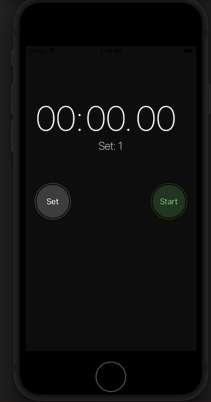

# React Native App: Set Counter And Timer

## Screenshot: 

## Description: 
Built a simple application to count and time the number of (workout) sets. The app resembles the stopwatch tab from the Clock app in iOS. The functionaliy is also similar, but the timer can be used independently from the set counter. The set counter and set table do not get reset with the timer. This is to allow the user to use the timer for other than timing the sets. The timer is made using `Date.getTime()` and `setInterval()` objects. 

## "Components":
A set of components are created to represent each aspect of the application.

* **Timer**: takes in a interval and style as parameters. Minutes, seconds, and centiseconds are displayed using the 'moment' library and each is its own \<Text> tag with the provided style. 
* **RoundButton**: takes in a title, title color, background color, on touch functions, and a boolean to determine whether it is disabled. Each button has the same width and height of 80px. 
* **SetRow**: takes an index and a time interval. Represents a row in a setTable (below). 
* **SetTable**: takes in a list of time intervals and displays them as setRows. 

## Usage: 
If the user hits 'Start', the timer will start. If the user hits 'Stop' the timer will stop. Once the user hits 'Stop', the 'Reset' button will become availaible and will reset the timer only. If the user hits 'Set' a set will be added to the set counter and the set table. If the user long presses the 'Set' button, the set counter and set table will be reset. 
